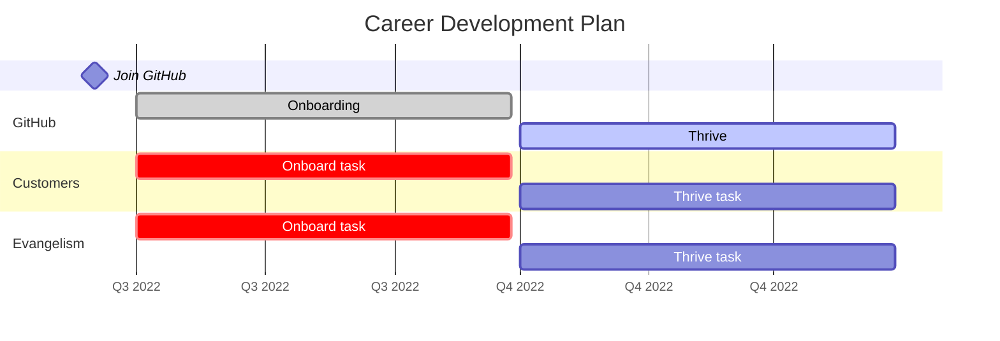

# Personal Development Plan - Chris Reddington

In this repository, you will find information about my Personal Development Plan. This includes a look at my career history, and my thoughts to the future. This is a continued work in progress.

## Vision

> The purpose of the vision section is to highlight your overall career aspiration. This includes information about your **interests, values and those abilities or areas that inspire you**. It also showcases **where you have been, and how it will influence where you will go** in the future.

### Career Aspiration

**Building, growing and inspiring development communities to create innovative experiences and be more productive. All while growing usage and influencing the technical roadmap of a leading platform that developers love to use day-in-day-out.**

### Role History

* 2014 - 2015 - Devices & Mobility Consultant, Microsoft Consulting Services
* 2015 - 2015 - Technical Account Manager, Microsoft Premier Support
* 2015 - 2017 - Application Development Manager, Microsoft Premier Support
* 2017 - 2018 - FastTrack for Azure Engineer, Microsoft Azure Engineering
* 2018 - 2021 - Sr. FastTrack for Azure Engineer, Microsoft Azure Engineering
* 2021 - 2022 - Cloud Solution Architect, Microsoft Customer Success Unit (Digital & App Innovation)
* 2022 onward - Enterprise Advocate, GitHub

## Goals

> The purpose of the goals section is to document the goals that you have, both **short-term and long-term**. These goals align with your vision, and should be measurable / tangible.

* Your **long-term goal** is the destination of your career path (i.e. Strategic). You [can find those here](https://github.com/chrisreddington/personal-development-plan/labels/Goal%2Flong-term).
* Your **short-term goals** help you achieve your long-term goal (i.e. Tactical). You [can find those here](https://github.com/chrisreddington/personal-development-plan/labels/Goal%2Fshort-term).

## Development Summary

> The development summary section is used to articulate the **current state of your development strengths and opportunities**.
> 
> **Strengths**
> 
> * Skills
> * Reputation or network
> * Competencies or Knowledge
> 
> **Opportunities**
> These can also be referred to as limitations, development needs or possible success inhibitors.
>
> * Skills
> * Reputation or network
> * Competencies or Knowledge
> * What behaviours might potentially be performance or career derailers?
>

### Strengths

You can find my strengths broken into several subsections below.

#### Key Experiences

* Building a global Delivery Organization (FastTrack for Azure)
* Rolling out a global offering for Services (Azure Solution Assessment)
* Public speaking engagements (Meetup Groups, Cloud with Chris, Online webinars with partners)

#### Strengths Finder Results [[Link](https://www.gallup.com/cliftonstrengths/en/253715/34-cliftonstrengths-themes.aspx)]

Completed the [StrengthsFinder assessment](https://www.gallup.com/cliftonstrengths/en/254033/strengthsfinder.aspx) with the following results:

* Executing > [Achiever](https://www.gallup.com/cliftonstrengths/en/252134/achiever-theme.aspx)
* Influencing > [Competition](https://www.gallup.com/cliftonstrengths/en/252191/competition-theme.aspx)
* Strategic Thinking > [Futuristic](https://www.gallup.com/cliftonstrengths/en/252248/futuristic-theme.aspx)
* Executing > [Discipline](https://www.gallup.com/cliftonstrengths/en/252227/discipline-theme.aspx)
* Executing > [Focus](https://www.gallup.com/cliftonstrengths/en/252239/focus-theme.aspx)

#### Behaviour Pattern Assessment Results

**Supporting – Analysing (S – A)**
Systematic approach. Detail oriented. Perceived as cautious, determined in accomplishing their goals. Tend to take things personally and worry about conflict, rather than dealing with it.  Often prefer working alone, but work well with small groups. Can be counted on even when things are difficult.

**Supporting – Influencing (S – I)**
Warmth. Openness. Understanding. Friendship. Loyal to relationships/organizations. Perception of value is 'linked to whether others or not like me'. Strongly affected by conflict. Often carry the burdens home. 

### Opportunities

* **Building and leading communities** – Inspiring others to come along on a journey (influencing for impact without authority), whether they are already bought in or not. Ability to see value in all opinions and negotiate a win-win situation for all.

* **Enhanced public speaking presence** – Continue to grow skills beyond current capabilities, working towards key note speaker at large conferences. Have hosted at Microsoft Build UK, presented at hundreds of meetup groups, customer briefings, vlogs and more.

* **People Management** – Prepare for potential step towards management. Continue to hone coaching/mentoring skills in preparation for this, and identify opportunities for hands-on experience.

## Development Plan

> The purpose of this section is to detail the actions that you will take to get from the current state in your career, to your desired state. This will evolve over time, and should continue to be reviewed and updated. Choose specific areas of focus, so that you can get the most out of your development activities. Be tangible, and actionable with your choices.
> 
> **Tip:** Consider the 70/20/10 rule, as scaffolded in the plan below.
>
> When selecting opportunities, consider
> * Ones that push you beyond your comfort zone
>   * Does this activity fall outside my normal comfort zone?
>   * Is this activity a step up in terms of breadth and difficulty of responsibilities?
> * Ones that leverage existing abilities
>   * Do I have skills and abilities to build on and help me succeed while tackling new challenges?
> * Ones that offer accountability, visibility, and relevance
>   * Do I have ownership for the outcome of this activity?
>   * Will I be able to easily identify the lessons I learn from this activity?
>   * Is it clear why the lessons from this particular activity will be useful to me?
>   * Will the lessons I learn from this activity be beneficial to my role?
>
> For each of the items, describe the activity and be specific -
> * What will you do?
> * When will you do it?
> * How will you measure your success?

### 70% - Learning on the job

Learning on the job items [can be found here](https://github.com/chrisreddington/personal-development-plan/issues?q=is%3Aissue+is%3Aopen+label%3ALearning%2Fjob).

### 20% - Learning from others

Learning from others items [can be found here](https://github.com/chrisreddington/personal-development-plan/labels/Learning%2Fothers).

### 10% - Learning through training

Learning through training items [can be found here](https://github.com/chrisreddington/personal-development-plan/labels/Learning%2Ftraining).
